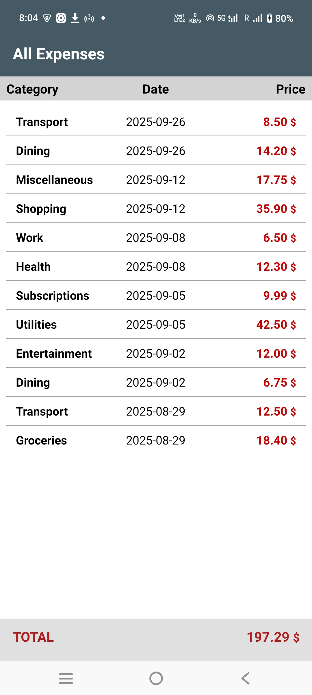

# 📱 ExpenseTracker (Where it Went)
*A simple, offline-first budgeting app designed for daily use.*

# Where It Went

**Track your spending — not your soul.**  
*A no-fluff, privacy-respecting expense tracker built for real life.*

---

<h2 style="font-size:1.6em; font-weight:700;">🧭 What Is This?</h2>

**Where It Went** is a simple, focused daily expense tracker designed for people who just want to know:  
> _“Where did all my money go?”_

No budgeting tools.  
No account syncing.  
No ads.  
No cloud.  
No sign-ups.  
No surveillance.

Just a clean interface that lets you log your expenses quickly, then shows you **where it went** — by day, month, or category.

---

<h2 style="font-size:1.6em; font-weight:700;">🌱 Why It Exists</h2>

Most expense trackers are either:

- Overly complicated (QuickBooks in disguise),
- Clunky or ugly,
- Infested with trackers and ads,
- Or make you link your bank just to log a sandwich.

**Where It Went** was born out of personal frustration with all of the above.  
It's made for people who value **clarity, simplicity, and privacy**.

It works *because* it doesn’t try to do everything — just one thing well.

---

<h2 style="font-size:1.6em; font-weight:700;">✨ Key Features</h2>

- 📆 **Track daily expenses** in seconds  
- 📊 **Clear overviews**: by day, month, or category  
- 🧠 **Project / trip friendly**: great for focused tracking  
- 🚫 **No income tracking**: we leave that to your bank  
- 🔒 **No cloud, no tracking, no ads, no nonsense**  
- 💡 **Fully offline** – your data stays on your device

---

<h2 style="font-size:1.6em; font-weight:700;">🛠️ Who It’s For</h2>

- People who just want to track spending without a spreadsheet  
- Makers, DIYers, and travelers who track **projects and trips**  
- Privacy-conscious users who don’t want to trade data for features  
- Anyone tired of bloated apps that solve the wrong problems

---

<h2 style="font-size:1.6em; font-weight:700;">📦 Installation</h2>

Coming soon to [F-Droid](https://f-droid.org)  
(Or sideload the APK from [Releases](https://github.com/your-repo/releases) on GitHub)

---

<h2 style="font-size:1.6em; font-weight:700;">📌 Philosophy</h2>

> _“A system is only as good as the data you feed it.”_

**Where It Went** is built on this truth.  
It’s dead simple to use — but still relies on you to enter what you spend, accurately and consistently.

The reward?  
A clear snapshot of where your money went — no guesswork, no logins, no fluff.

Perfect for:
- Daily habit tracking (a few seconds per entry)
- Long-term project expenses (builds, hobbies, renovations)
- Trip budgeting and analysis (hotels, gas, food, the *“oops”* fund)

---

<h2 style="font-size:1.6em; font-weight:700;">🧱 Open Source</h2>

- 100% open source (license: MIT or your preferred license)  
- No hidden dependencies, no phone-home behavior  
- Built with minimalism and transparency in mind

---

<h2 style="font-size:1.6em; font-weight:700;">🙌 A Note from the Developer</h2>

This app was created out of personal need, not profit.  
It’s not trying to be everything — just something **useful, honest, and respectful**.

If it helps you, that’s all the reward I need.

---

<h2 style="font-size:1.6em; font-weight:700;">📬 Feedback & Contributions</h2>

Suggestions, bug reports, or feature ideas?  
Open an issue or get in touch.

Let's keep it simple — and keep it useful.

## 📱 Screenshots

| Main Menu | Add Expense | View Menu |
|-----------|-------------|-----------|
|  |  |  |

| View All | By Date | By Category |
|----------|---------|-------------|
|  |  |  |

| By Month | Settings | Edit Item |
|----------|----------|-----------|
|  |  |  |

---

## 📄 License
This project is licensed under the MIT License. See [LICENSE](LICENSE) for details.

